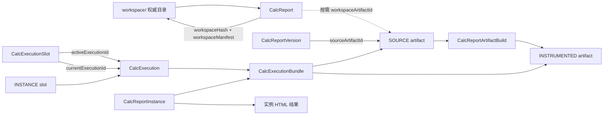
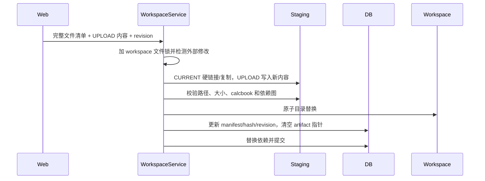

# CalcReport 工作空间、执行槽与文件回收规范

## 1. 目标

本规范描述计算报告源码、发布版本、计算执行和计算实例的当前实现。核心目标是：

1. 工作空间频繁保存时不再生成完整 SOURCE artifact。
2. 每个业务目标只保留一个正在执行的任务和最后一次成功结果。
3. 失败、取消和被替换的执行不形成历史回溯依赖。
4. 无业务引用的 bundle、build、artifact 和结果文件能够被清理。

系统不提供执行历史查询，也不保证旧执行可以回溯。

## 2. 核心关系



`CalcExecutionSlot` 的目标类型为枚举：

- `WORKSPACE`：用户的某个报告工作空间。
- `VERSION`：用户的某个已发布版本；`LATEST` 运行解析后归入具体版本。
- `INSTANCE`：用户的某个计算实例。
- `SHARE_PREVIEW`：某个分享链接的内部预览。

每个目标通过部分唯一索引保证至多一个 slot。

## 3. 磁盘目录

```text
data/
├── calc-reports/{userId}/{reportOid}/
│   └── workspace/                       # 可修改源码的唯一权威目录
├── calc-artifacts/sha256/{prefix}/{hash}/
│   ├── manifest.json
│   └── payload.zip                      # 按需冻结的不可变内容
├── calc-bundles/sha256/{prefix}/{hash}/ # 可执行闭包缓存
├── public/calcs/{userId}/{executionOid}/# slot 当前执行结果
└── calc-instances/{userId}/{instanceOid}/# 实例永久结果
```

不再创建以下冗余投影：

- `version/v_{major}_{minor}_{patch}/`
- `latest.json`

发布版本的权威关系是 `CalcReport.latestVersionId` 和
`CalcReportVersion.sourceArtifactId`。

## 4. 工作空间是可变权威源

### 4.1 数据库元数据

`CalcReport` 保存以下工作空间状态：

| 字段 | 含义 |
| --- | --- |
| `workspaceRevision` | API 乐观并发版本及外部修改序号 |
| `workspaceHash` | 当前目录的规范化内容哈希 |
| `workspaceManifest` | 文件路径、大小、SHA-256、mtime/ctime 和依赖声明 |
| `workspaceArtifactId` | 当前内容已冻结时对应的 SOURCE artifact，可空 |

`workspaceHash` 的规范化输入不包含 mtime，因此只由 `calcbook`、依赖声明及文件的路径、
大小和内容哈希决定。

### 4.2 保存流程



保存阶段不调用 `publish_source()`。大图片、Excel 等未修改的 `CURRENT` 文件优先通过
硬链接写入暂存目录，并复用 manifest 中的内容哈希；只有上传文件或 mtime/大小发生变化
的文件需要重新读取和哈希。

暂存目录完整校验后才替换 `workspace/`。数据库提交失败时恢复替换前目录，避免数据库与
文件系统静默分叉。

### 4.3 直接文件修改

桌面端或外部工具可以直接修改 `workspace/`。以下入口会扫描目录并与已保存的
size/mtime/ctime 比较：

- 获取工作空间；
- 再次保存工作空间；
- 发布版本；
- 运行 workspace。

检测到内容变化后，服务端重新计算受影响文件哈希，增加 `workspaceRevision`，更新
`workspaceHash/workspaceManifest`，并清空 `workspaceArtifactId`。因此直接文件修改不会
绕过发布状态和运行来源判断。

## 5. SOURCE artifact 按需冻结

`ensure_workspace_artifact()` 只在需要不可变边界时调用：

1. 发布版本。
2. 运行当前 workspace。

它在 workspace 文件锁内再次检测外部修改。若 `workspaceArtifactId` 的内容哈希与当前
`workspaceHash` 一致，直接复用；否则读取当前目录并调用 `publish_source()`，创建或复用
内容寻址 SOURCE artifact，然后更新指针。

普通保存、读取文件、修改依赖和修改报告元数据都不会冻结 artifact。

恢复版本、复制报告和导入分享时，artifact 会被物化为新的权威 `workspace/`，同时生成
对应的 workspace manifest/hash。复制报告直接复制当前权威目录，不要求源报告已冻结。

## 6. 发布版本

发布流程为：

1. 锁定并校验当前 workspace。
2. 按需冻结或复用 SOURCE artifact。
3. 执行 Python 入口及静态依赖导入校验。
4. 创建 `CalcReportVersion`，指向 SOURCE artifact。
5. 更新 `CalcReport.latestVersionId`。

版本不保存工作空间目录副本。恢复版本时，使用版本的 SOURCE artifact 原子替换当前
workspace，并增加 workspace revision。

## 7. 执行槽

### 7.1 启动与继续

一个 slot 同时保存：

- `activeExecutionId`：当前正在交互或运行的执行。
- `currentExecutionId`：最后一次成功且结果已缓存的执行。

同一 slot 已存在 active 执行时，新启动请求返回 `409`。启动新执行不会先删除
`currentExecutionId`，因此新执行失败时旧成功结果仍可用。

交互式 continue 复用同一个 sandbox session 和 execution 行，不重新解析版本或 bundle。
`UserInputHistory` 只保存当前执行的 defaults 和最新 input windows，不保存步骤历史。

### 7.2 成功替换

执行完成且 HTML 已成功缓存后，事务执行以下操作：

1. 将新执行设为 `currentExecutionId`。
2. 清空 `activeExecutionId`。
3. 删除新结果的一小时 `TmpFile` 登记，使其由 slot 生命周期管理。
4. 删除上一条 current execution 及其普通结果目录。

因此 workspace、具体版本、实例和分享预览分别只保留最后一次成功执行。

### 7.3 失败、取消与重启恢复

- 执行失败：清空 active，删除失败 execution，不替换 current。
- 用户取消：终止 sandbox，清空 active，删除 execution 和结果。
- API 重启：启动恢复任务删除遗留的 `PENDING/RUNNING` execution，并保留 current。

失败和取消执行不提供审计历史。

### 7.4 查询接口

报告执行使用：

```text
GET /v1/calc/execution/current?reportOid=...&sourceType=...&versionName=...
```

已移除执行 `/count` 和 `/items` 接口及前端执行历史页面。前端切换 workspace、latest 或
具体版本时，直接读取对应 slot。

## 8. 计算实例

实例创建时保存：

- 固定 `bundleId`；
- 固定发布版本关系（若有）；
- defaults 和 input windows；
- 复制到实例目录的 HTML 结果。

实例重新运行使用其保存的 immutable bundle，不重新解析当前 workspace、latest 或依赖。
若当前后端 runtime fingerprint 与 bundle 不一致，返回冲突错误，而不是悄悄重建为不同
来源。

实例有独立 `INSTANCE` slot。实例执行成功后，后端自动替换实例结果、defaults 和 input
windows；前端不再提供“从另一条执行手工更新实例结果”的接口。

删除实例会物理删除实例、分享、实例 slot、其保留 execution 和实例结果目录。

## 9. 分享预览

每个 `CalcReportShareLink` 使用独立 `SHARE_PREVIEW` slot。分享预览成功后只替换该分享的
最后结果；分享预览不会占用报告 workspace 或版本 slot，也不会形成可查询历史。

修改分享所指版本后，下次预览从新版本启动。删除分享会级联删除 share slot；无其他引用
的 execution/bundle/artifact 由后续回收处理。

## 10. 报告删除

删除报告遵循以下规则：

1. 仍被其他报告依赖时返回 `409`，并返回依赖报告数量，不修改任何数据。
2. 允许删除时先删除报告分享及相应执行。
3. 存在计算实例时软删除报告身份；实例的 bundle 和独立结果继续可用。
4. 不存在实例时删除版本、执行槽、执行、来源关系和报告业务行。
5. 删除报告的 workspace 目录。

实例不依赖报告 workspace 目录，因此软删除报告后不需要保留可变源码文件。

## 11. Bundle 与 artifact 回收

`CalcCacheCleanerScheduleJob` 每天执行两阶段回收。数据库对象必须创建超过 24 小时才成为
候选，以避开“build 已提交但 bundle/execution 尚未创建”的并发窗口。

数据库阶段按顺序删除：

1. 没有 execution 或 instance 引用的 bundle；组件通过级联删除。
2. 非 BUILDING 且 output 未被任何 bundle 使用的 artifact build。
3. 未被 workspace 指针、版本、origin、bundle、组件或 build 引用的 artifact。

文件阶段读取提交后的数据库 hash 集合，仅删除超过 24 小时且数据库已不存在对应行的
artifact/bundle 哈希目录。数据库事务失败时不删除文件；文件删除失败时下次任务重试。

该顺序保证正式版本、当前冻结 workspace、最后成功 slot 和实例仍是保护根，同时允许被
成功执行替换掉的中间 bundle/artifact 最终释放。

## 12. 输入缓存

`InputCache` 按 `(userId, reportId, entryName)` 保存最近输入。它使用 `sourceHash` 判断缓存
是否适用于当前来源，不再通过外键保护某个临时 SOURCE artifact。缓存过期或来源变化时
可以直接覆盖，不阻止 artifact 回收。

## 13. 并发与故障边界

- workspace 使用报告目录下的文件锁串行化保存、扫描和冻结。
- workspace revision 负责客户端乐观并发，外部修改也会推进 revision。
- slot 的目标唯一索引负责每用户业务目标隔离。
- active/current 分离保证失败执行不覆盖最后成功结果。
- artifact 和 bundle 使用内容哈希唯一约束复用全局不可变内容。
- 数据库外键是回收遗漏引用时的最后防线。
- 磁盘缓存缺失时，SOURCE 可从当前 workspace 重新冻结，bundle 可从仍受保护的 artifacts
  重新物化。

## 14. 验收场景

实现至少满足以下场景：

1. 连续保存只修改一个小文件时，不读取并压缩未变化的大图片或 Excel 文件。
2. 普通保存不会创建 `CalcReportArtifact`；首次发布或运行才冻结 SOURCE。
3. 外部直接编辑文件后，读取/发布/运行能检测变化并推进 revision/hash。
4. workspace 和每个具体版本分别只保留最后一次成功执行。
5. 新执行失败或取消时，上一条成功结果仍可查询。
6. 实例从固定 bundle 运行，成功后自动更新实例结果。
7. 分享预览与报告及实例执行槽互不覆盖。
8. 被替换执行不再保护旧 bundle；超过安全窗后数据库和磁盘缓存均可回收。
9. 有依赖的报告不可删除；有实例的报告删除后实例仍可查看和运行。
10. SQLite 与 PostgreSQL 初始迁移均包含 slot 唯一约束和循环版本外键。
